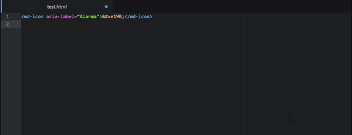

# atom-material-icons-snippets
---

Snippets for Material Icons using it's unicodes value instead of ligatures. For compatibility with older browsers or when developing for Android  <= 4.4 Kit Kat
It also provides previews for the icons, based on atom-autocomplete-font-awesome



## Features


- Snippets when start tipping by "md_". For example, "md_3d_rotation" will be converted to:
```
<md-icon aria-label="md_3d_rotation">&#xe84d;</md-icon>
```
- Uses unicodes instead of ligatures for compatibility purposes with Android Kit Kat <= 4.4
- Aria-label tag to specify what your icon means (it's need for a11y if not using ligatures)
- Previews alongside snippets. Don't need to go to Material Icons page searching for the accurate icon!

## TODO:
- Add aliases or terms that make search for icons more useful.
- Perhaps a bigger preview for icons(?)


## Installation

Go into Atom's Settings/Preferences &gt; Install &gt; search for `material-icons-snippets`

Or install via the command line:

```
apm install material-icons-snippets
```

## Credits
* Based on atom-autocomplete-font-awesome (https://github.com/lonekorean/atom-autocomplete-font-awesome) from Will Boyd [@lonekorean]
